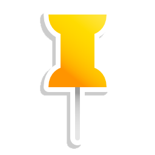
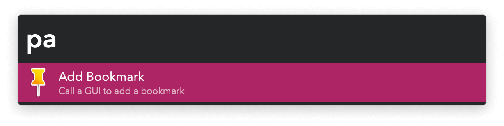
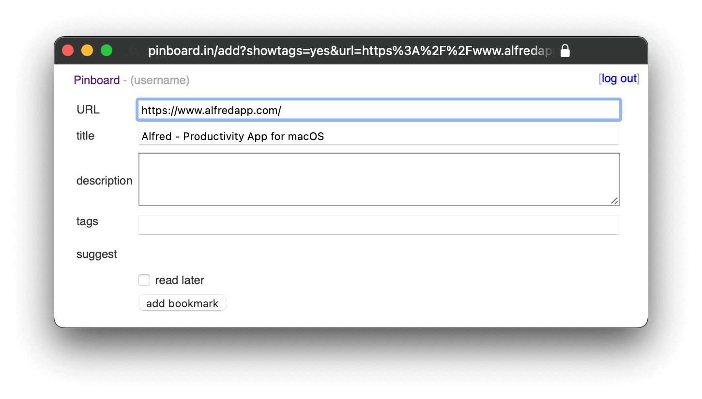
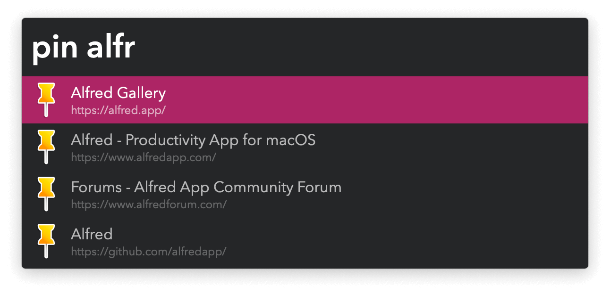

#  Pin Plus Alfred Workflow

Interact with your Pinboard bookmarks

[⤓ Install on the Alfred Gallery](https://alfred.app/workflows/vitor/pin-plus)

## Usage

Add a new bookmark to your [Pinboard](https://pinboard.in) account via the `pa` keyword.

Search all bookmarks via the `pin` keyword or only the unread ones with `pun`. Actioning an unread bookmark can archive or delete it if the option is set in the [Workflow’s Configuration](https://www.alfredapp.com/help/workflows/user-configuration/).

* <kbd>↩&#xFE0E;</kbd>: Open URL.
* <kbd>⌘</kbd><kbd>↩&#xFE0E;</kbd>: Copy URL.
* <kbd>⌥</kbd><kbd>↩&#xFE0E;</kbd>: View Tags.
* <kbd>⌃</kbd><kbd>↩&#xFE0E;</kbd>: View Description.
* <kbd>⇧</kbd><kbd>↩&#xFE0E;</kbd>: Open in Pinboard’s Website.

Configure the [Hotkeys](https://www.alfredapp.com/help/workflows/triggers/hotkey/) as a shortcut to add bookmarks, add the current browser tab as an unread bookmark, or open a random unread bookmark.

Bookmarks are automatically fetched if the local data is old, but an update can be forced with <kbd>fn</kbd><kbd>↩&#xFE0E;</kbd>.
